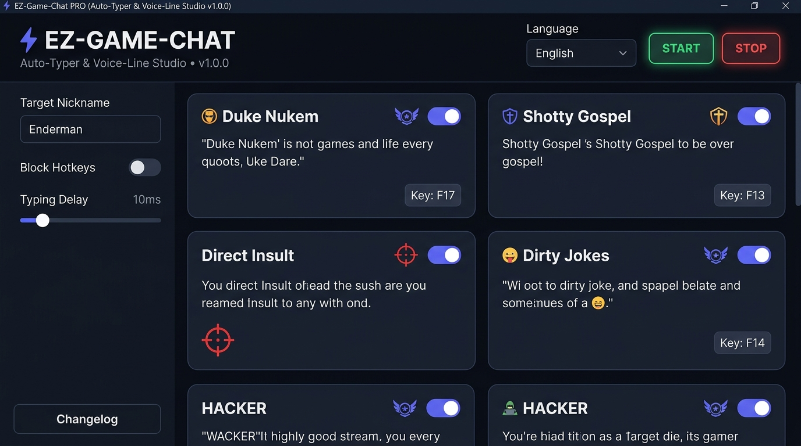

# ⚡ EZ-Game-Chat

A modern, high-performance in-game auto-typer and voice-line chat studio designed for multiplayer games and FPS titles.


<p align="center">
  
</p>

---

## ✨ Features

- **⚡ Fast In-Game Auto-Typer**: Send quick quotes, voice-lines, or custom messages into in-game chats with customizable typing delays.
- **🎯 Target Nickname Studio**: Live placeholder replacement (`{name}`, `{target}`, `{player}`, etc.) dynamically substituted with any player's nickname on the fly.
- **📝 Quotes & Categories Editor**: Add, edit, delete, and reorder categories and messages directly inside the app with instant auto-save.
- **⌨️ Real-Time Visualizer**: Interactive on-screen visualizer displaying your key bindings and active keystrokes.
- **🛡️ Low-Level Shortcut Blocker**: Optional hook to suppress accidental Windows Key, Ctrl, Alt, and Shift system shortcuts during intense gaming sessions.
- **🎨 Modern Dark UI**: Sleek glassmorphism-inspired dark theme built with CustomTkinter and support for drag-and-drop custom category badges/icons.
- **🌐 Multi-Language Support**: English, Polish (Polski), Spanish (Español), Portuguese (Português), and German (Deutsch).

---

## 🚀 Quick Start (Running from Source)

### Requirements
- **Windows 10 / 11**
- **Python 3.10+** (or [uv](https://github.com/astral-sh/uv))

### 1. Clone the repository
```bash
git clone https://github.com/zabique/EZ-Game-Chat.git
cd EZ-Game-Chat
```

### 2. Launch
Simply run `start.bat`:
```cmd
start.bat
```
*`start.bat` will automatically create a `.venv` virtual environment, install required packages (`requirements.txt`), and launch the application with Administrator elevation (required for global in-game hotkeys).*

---

## 📦 Building the Standalone Installer

To build the standalone executable and Inno Setup Windows installer:

```cmd
build.bat
```

- **Standalone EXE**: `dist\EZ-Game-Chat\EZ-Game-Chat.exe`
- **Setup Installer**: `Output\EZ-Game-Chat_Setup.exe`

---

## ⚙️ Configuration & Key Bindings

- Click **Set Key** on any category card and press the desired key (e.g. `F13`–`F24`, macro keys, numpad keys).
- Assign a **Target Nickname** in the sidebar to automatically format quotes containing `{name}`.
- Switch between **Sequential** and **Random** quote playback modes per category.

---

## 📄 License
This project is open source and available under the [MIT License](LICENSE).
